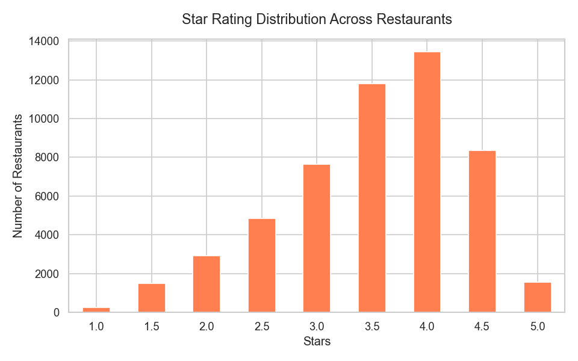
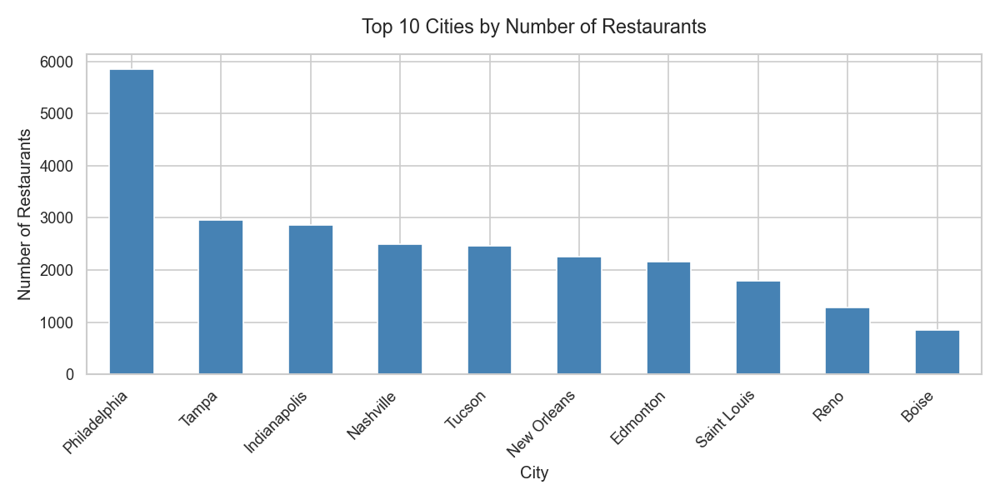
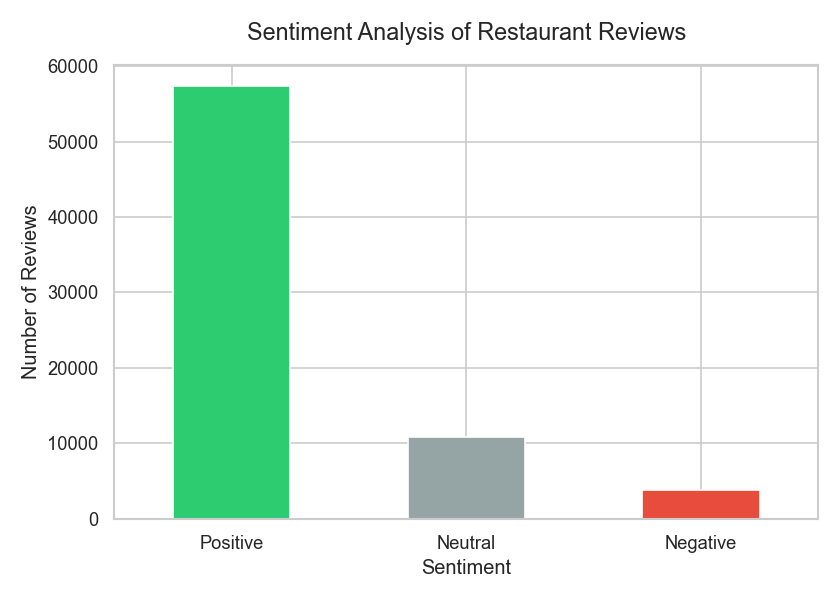
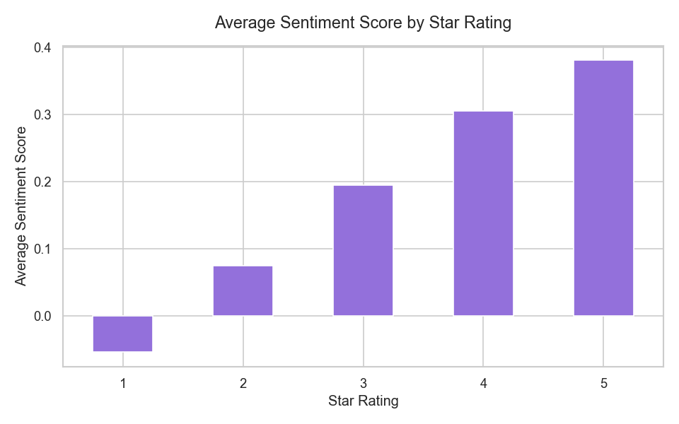
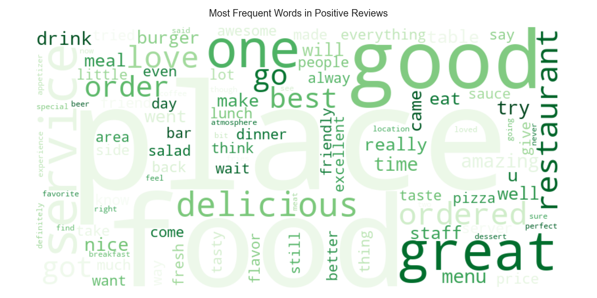
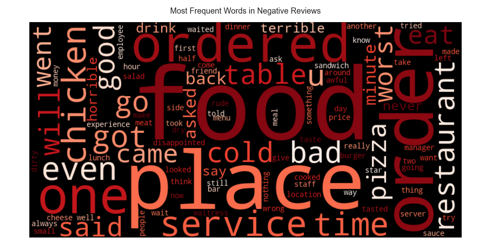

# 🍽️ Restaurant Reviews Analysis

Exploratory data analysis and sentiment classification of 70,000+ restaurant reviews using the Yelp Open Dataset.

---

## 📊 Overview

This project analyzes restaurant reviews to uncover patterns in customer satisfaction, identify key factors that differentiate positive from negative experiences, and validate sentiment analysis against star ratings.

**Key findings:**
- 79% of reviews are positive, only 5% are negative
- The most common restaurant rating is 4 stars
- Philadelphia has the highest concentration of restaurants in the dataset
- Sentiment scores align with star ratings, validating the model
- Satisfied customers highlight **service and experience**; unhappy customers mention **wait times and incorrect orders**

---

## 🛠️ Tech Stack

- **Python 3.13**
- **Pandas** — data loading and manipulation
- **Matplotlib / Seaborn** — visualizations
- **TextBlob** — sentiment analysis
- **WordCloud** — word frequency visualization

---

## 📁 Project Structure
restaurant-reviews-analysis/
├── restaurant_reviews_analysis.ipynb   # Main analysis notebook
├── outputs/                            # Generated visualizations
│   ├── 01_star_distribution.png
│   ├── 02_top_cities.png
│   ├── 03_sentiment_distribution.png
│   ├── 04_stars_vs_sentiment.png
│   ├── 05_top_restaurants.png
│   ├── 06_wordcloud_positive.png
│   └── 07_wordcloud_negative.png
└── README.md
---

## 📈 Visualizations

### Star Rating Distribution

### Top 10 Cities by Number of Restaurants

### Sentiment Analysis

### Sentiment vs Star Rating

### Most Frequent Words — Positive Reviews

### Most Frequent Words — Negative Reviews

---

## 🚀 How to Run

1. Download the [Yelp Open Dataset](https://www.yelp.com/dataset)
2. Place `yelp_academic_dataset_business.json` and `yelp_academic_dataset_review.json` in a `data/` folder
3. Install dependencies: pip install pandas matplotlib seaborn textblob wordcloud
4. Open and run `restaurant_reviews_analysis.ipynb`

---

## 📌 Dataset

This project uses the [Yelp Open Dataset](https://www.yelp.com/dataset), which is available for academic use only. The raw data files are not included in this repository.

---

## 👤 Author

**Vicente Sánchez Reza**  
[github.com/vicentszr](https://github.com/vicentszr)
